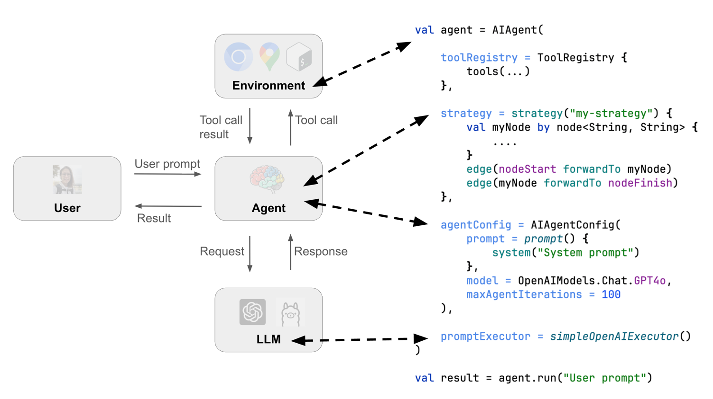

# Koog Workshop

Public workshop materials for [Koog](https://koog.ai) - Kotlin AI Agents Framework.

## Structure

The repository is organized as follows:
* `main` branch is a template to start develop you Koog agent 
* `task` branch is a playground for the workshop with step-by-step exploration of the Koog API such as:
  * `Prompt` and `PromptExecutor`
  * `Tool` and `ToolRegistry`
  * `Strategy` and the implementation of `singleRunStrategy`
  * `Agent` and `AgentConfig`
* `hint` branch contains hints and solutions for the task

To switch between branches use `git checkout <branch_name>` command.

## Useful materials
* [Koog documentation](https://koog.ai/docs) - official documentation for Koog
* [Koog GitHub repository](https://github.com/koog-ai/koog) - source code of Koog where you can find examples
* [Kotlin documentation](https://kotlinlang.org/docs) - official documentation for Kotlin in case you need to check something
